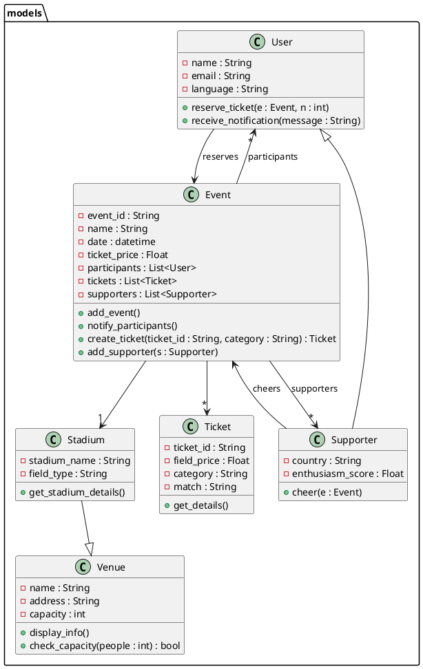

Voici ton texte **séparé clairement** :
1️⃣ **Version anglaise d’abord**
2️⃣ **Version française ensuite**

---

# 🇬🇧 AgentAI – Ticket Reservation for the FIFA World Cup 2026

## Description

AgentAI is an intelligent API built with **FastAPI** that allows you to:

* Reserve tickets for the **FIFA World Cup 2026**
* Check the available capacity in a stadium
* Notify users who have reserved tickets

---

## Running the Application

```bash
uvicorn main:app --reload
```

---

## Project Architecture

```
AgentAI/
│
├── gui/                  🌐 API Interface
│   └── interface.py
│
├── routes/               🚦 AI Routes
│   └── reservation_routes.py
│
├── data/                 📁 JSON Storage
│   └── billets.json
│
├── models/               🧩 Python Models
│   ├── utilisateur.py
│   ├── supporter.py
│   ├── lieu.py
│   ├── stade.py
│   ├── billet.py
│   └── evenement.py
│
├── services/             🔧 Business Logic
│   └── reservation_service.py
│
├── utils/                🛠️ Utility Functions
│   └── data_manager.py
│
├── main.py               🚀 FastAPI Entry Point
├── requirements.txt      📦 Dependencies
└── README.md             📖 Project Overview
```

---

## UML Diagram (PlantUML)



---

## Notes

* Classes inside the **models/** folder are grouped in the **models package**.
* **Inheritance relationships** are modeled (Supporter inherits from User, Stadium inherits from Venue).
* **Composition relationships** (Event → Ticket, User, Supporter, etc.) are represented with arrows.
* Other packages (**gui, routes, services, utils**) show how components interact with each other.

---

## Available Routes

### `/ia/reservation_billet`

Returns information about reserved tickets.

### `/ia/capacite_stade`

Provides information about available stadium seats.

### `/ia/notifications`

Lists the notifications sent to users.

---

## Example AI Questions

* How many tickets have been reserved?
* Are there seats still available?
* Who received a notification?

---

## Route: `/ia/reservation_billet`

### Possible Questions

* How many tickets have been reserved?
* Which tickets are reserved?
* Show me the ticket details.
* Who reserved a ticket for the match?

### Expected Response

3 tickets have been reserved:

* Oussama → Gate A, Row 3, Seat 14, Gold Category
* Glody → Gate B, Row 2, Seat 7, Silver Category
* Babatunde → Gate A, Row 1, Seat 1, Bronze Category

Match: Final – Address: BMO Field

---

## Route: `/ia/capacite_stade`

### Possible Questions

* Are there still seats available?
* How many seats remain in the stadium?
* What is the remaining capacity?

### Expected Response

47,000 seats are still available at **BMO Field Stadium**
(capacity: 50,000 – 3 tickets already reserved).

---

## Route: `/ia/notifications`

### Possible Questions

* Who received a notification?
* Which users were notified?
* Notifications were sent to whom?

### Expected Response

A notification has been sent to:

* Oussama ([oussama@example.com](mailto:oussama@example.com))
* Glody ([glody@example.com](mailto:glody@example.com))
* Babatunde ([babatunde@example.com](mailto:babatunde@example.com))

---

## How to Ask Questions

In the Swagger interface:

```
http://127.0.0.1:8000/docs
```

Steps:

1. Click on the route **/ia/reservation_billet**
2. Click **Try it out**
3. In **question**, write:
   **"How many tickets have been reserved?"**
4. Click **Execute**

---

# 🇫🇷 AgentAI – Réservation de billets pour la Coupe du Monde 2026

## Description

AgentAI est une **API intelligente construite avec FastAPI** permettant de :

* Réserver des billets pour la **Coupe du Monde FIFA 2026**
* Vérifier la capacité disponible dans un stade
* Notifier les utilisateurs ayant réservé

---

## Lancement de l’application

```bash
uvicorn main:app --reload
```

---

## Architecture du projet

```
AgentAI/
│
├── gui/                  🌐 Interface API
│   └── interface.py
│
├── routes/               🚦 Routes IA
│   └── reservation_routes.py
│
├── data/                 📁 Stockage JSON
│   └── billets.json
│
├── models/               🧩 Modèles Python
│   ├── utilisateur.py
│   ├── supporter.py
│   ├── lieu.py
│   ├── stade.py
│   ├── billet.py
│   └── evenement.py
│
├── services/             🔧 Logique métier
│   └── reservation_service.py
│
├── utils/                🛠️ Fonctions utilitaires
│   └── data_manager.py
│
├── main.py               🚀 Point d’entrée FastAPI
├── requirements.txt      📦 Dépendances
└── README.md             📖 Présentation du projet
```

---

## À noter

* Les classes du dossier **models/** sont regroupées dans le **package models**.
* Les relations **d’héritage** sont modélisées (Supporter hérite de Utilisateur, Stade hérite de Lieu).
* Les relations **de composition** (Evenement → Billet, Utilisateur, Supporter, etc.) sont représentées avec des flèches.
* Les packages **gui, routes, services et utils** montrent comment les composants interagissent entre eux.

---

## Routes disponibles

### `/ia/reservation_billet`

Répond sur les billets réservés.

### `/ia/capacite_stade`

Informe sur les places disponibles dans le stade.

### `/ia/notifications`

Liste les notifications envoyées.

---

## Exemple de questions IA

* Combien de billets ont été réservés ?
* Y a-t-il encore des places disponibles ?
* Qui a reçu une notification ?
